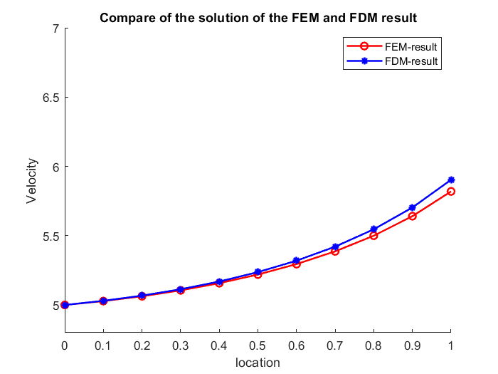

## 中文手册

---

本项目为计算流体力学(CFD,computational Fluid Dynamics) 的一个示例问题求解代码， 可以用于学习使用， 为下面一个问题提供了FDM(有限差分)解法和FEM(有限元)解法两种求解方法。 

问题描述: 

求解一维流动问题

$$\begin{cases}
(x^2 + 5) \frac{du}{dx} - 2\frac{d^2u}{dx^2} = 2x  , \qquad x \leq 0 \leq 1\\
u = 5 , \qquad \qquad  x = 0 \\
2 \frac{du}{dx}  = x + 3 \qquad x = 1
\end{cases}$$

本程序在Visual Studio 2019上运行 (需要注意，如果快速反复运行，会产生溢出错误， 此时可以尝试等待一段时间或者关闭 Visual Studio 并重新运行)

对于以上问题通过FEM和FDM两种方法使用c++语言求解，其中FEM方法需要Eigen和Boost第三方库的支持

两个库的安装配置教程见[Eigen和Boost的配置教程](tutorial_for_installing_Eigen_and_Boost.md)

求解结果如下:

## English README

---

This project is a sample code for solving a one-dimensional flow problem using computational fluid dynamics (CFD). It provides two numerical methods for solving the problem: finite difference method (FDM) and finite element method (FEM), Note that Eigen and Boost libraries are required for the FEM method. This program can be used for learning purposes.

The problem to be solved is a 1-D flow problem : 

$$\begin{cases}
(x^2 + 5) \frac{du}{dx} - 2\frac{d^2u}{dx^2} = 2x , \qquad x \leq 0 \leq 1\
u = 5 , \qquad \qquad x = 0 \
2 \frac{du}{dx} = x + 3 \qquad x = 1
\end{cases}$$

This program runs on Visual Studio 2019. However, please note that if it is run repeatedly and quickly, it may cause overflow errors. In this case, you can try waiting for a period of time or closing Visual Studio and running it again.

the process of installing Eigen and Boost are provided in [tutorial_for_installing_Eigen_and_Boost.md](tutorial_for_installing_Eigen_and_Boost.md)

and the solution is given as (the figure is plot by MATLAB)

