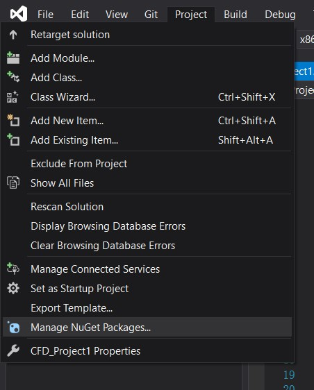

## Boost和Eigen第三方库的安装教程

---

一般而言， 使用Project -> Manage NuGet Packages 中，直接搜索并且安装Eigen库和Boost库即可, 一般不会出现冲突问题

如果出现ambiguous问题，可能是你修改了Project->Properties->include路径并使用Eigen的源码包导致的， 请不要修改对应的include路径, 如果出现上述问题可以通过在另一个位置新建工程并拷贝源码来尝试解决

